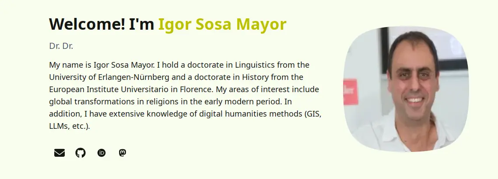

# Academic Portfolio

This is the code for generating the [Academic
Portfolio](https://rogorido.github.io) of Igor Sosa Mayor. 

It is based on [Astro Academia
Documentation](https://github.com/maiobarbero/astro_academia) created by
[Matteo Barbero](https://github.com/maiobarbero). Nevertheless I made
many modifications to the work done by Matteo. 

It uses the fabulous web framework [Astro](https://astro.build/).

